# E-commerce Full Stack Application 🛒💻

This is a full-stack E-commerce application built with Angular (frontend) and Java Spring Boot (backend). The application supports two user roles: **Admin** and **User**.

- **Admin**: Can perform CRUD operations on products.
- **User**: Can browse products, add them to the cart, and create orders (integrated with PayPal Sandbox for payments).

---

## 📄 Data Export

The application supports exporting product and order lists for the Admin role in the following formats:  
- **CSV**  
- **Excel**  
- **PDF**  

## Frontend Repository 🔗

The frontend of the application is built with Angular and can be found at:

[Frontend Repository - Angular](https://github.com/PagarciaSima/E-commerce-Angular-02-25)

---

## 🛠️ Features

- **User Authentication**: Secure login with **JWT-based authentication** using **Spring Security**.
- **Role-Based Access Control**: Different functionalities for Admin and User.
- **Product Management**: CRUD operations for products (Admin only).
- **Shopping Cart**: Users can add/remove products to/from the cart.
- **Order Processing**: Users can place orders and make payments via **PayPal Sandbox**.
- **Data Export**: Generate and download reports in **CSV, Excel, and PDF** formats.
- **Pagination & Search Filters**: Efficient data navigation with search and filtering options.
- **Charts & Analytics**: Visual representation of data using **JChart**.
- **Multi-language Support**: Supports multiple languages using **@ngx-translate/core**.
- **API Documentation**: Integrated with **OpenAPI** for API documentation.
- **Responsive Design**: Fully optimized for **desktop and mobile devices**.
- **Unit & UI Testing**:  
  - **Backend**: Unit tests with **Mockito**, test execution reports with **Surefire**.  
  - **Frontend**: Unit tests with **Jasmine & Karma**.
- **Security**:  
  - **Spring Security** for authentication and authorization.  
  - Protection against common security threats.

---

## ⚙️ Technologies

### Backend (Spring Boot 3.4.0 / Java 17)
- **Spring Boot 3.4.0** (Main framework)
- **Spring Web** (REST API development)
- **Spring Data JPA** (Database access with Hibernate)
- **Spring Security & JWT** (Authentication & Authorization)
- **MySQL** (Relational database)
- **Lombok** (Boilerplate code reduction)
- **JavaDotenv** (Environment variables management)
- **OpenAPI / Swagger** (API documentation)
- **Mockito & JUnit** (Unit testing)
- **Surefire Plugin** (Test reporting)

### File Management & Export 📑
- **Apache POI** (Excel file generation)
- **OpenCSV** (CSV file export)
- **iText 7** (PDF generation)
- **Commons IO** (File utilities)

### Payment Integration 💳
- **PayPal SDK** (Payment processing via PayPal)

### DevTools & Build Tools 🔧
- **Spring Boot DevTools** (Hot reload for development)
- **Maven** (Build automation & dependency management)
- **Maven Surefire Plugin** (Test execution reports)

---

## Frontend (Angular 16)
- **Angular 16** (Core framework)
- **Angular Material** (UI components & styling)
- **Bootstrap 5.3.3** (CSS framework)
- **ngx-toastr** (Notifications)
- **SweetAlert2** (Custom alerts & modals)
- **FontAwesome** (Icons)
- **RxJS** (Reactive programming)
- **Ngx-translate** (Internationalization)
- **Chart.js & ng2-charts** (Data visualization)
- **jwt-decode** (JWT handling)
- **File-saver** (File export utilities)
- **Zone.js** (Angular change detection)

### DevTools & Testing 🧪
- **Angular CLI** (Development tools)
- **TypeScript** (Type-safe JavaScript)
- **Jasmine & Karma** (Unit testing)
- **Karma Chrome Launcher** (Testing in Chrome)
- **Karma Coverage** (Test coverage reporting)

---

## Open API Documentation 📑

The API documentation for the application can be accessed via Swagger UI. You can explore the available endpoints in the following environments:

- **Local Development**:  
  [Swagger UI Local](http://localhost:8080/swagger-ui/index.html#/)

- **Production**:  
  [Swagger UI Production](https://pgsecommerce02-25-production.up.railway.app/swagger-ui/index.html#/)

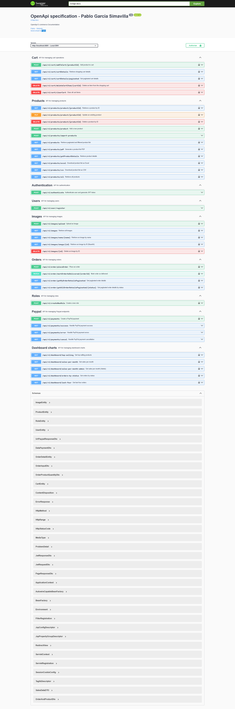

---

## Deployment 🚀

The application is deployed across different platforms for both the backend and frontend:

- **Backend**:  
  The backend, including the application and MySQL database, is deployed on **Railway** using Docker.  
  - **Docker**: The backend application is containerized with a custom `Dockerfile`.  
  - **MySQL**: The database is deployed using the official MySQL Docker image.

- **Frontend**:  
  The frontend is deployed on **Netlify**, ensuring fast and scalable delivery of the application to users.

You can access the application via the following URLs:

- **Production Backend**:  
  [Production Backend](https://pgsecommerce02-25-production.up.railway.app/)

- **Production Frontend**:  
  [Production Frontend](https://ecommerce-02-25.netlify.app/login)

---

## Interfaces 🖥️

### Login
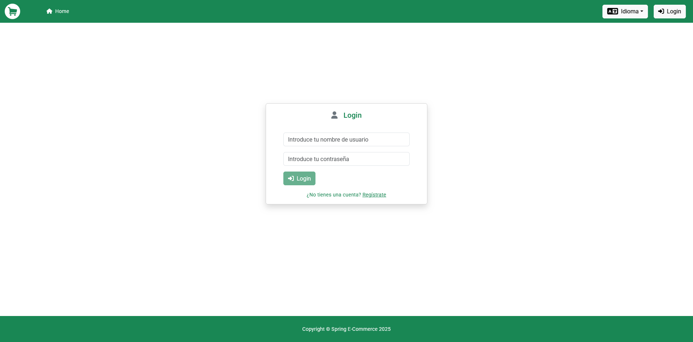

### Register

### Home
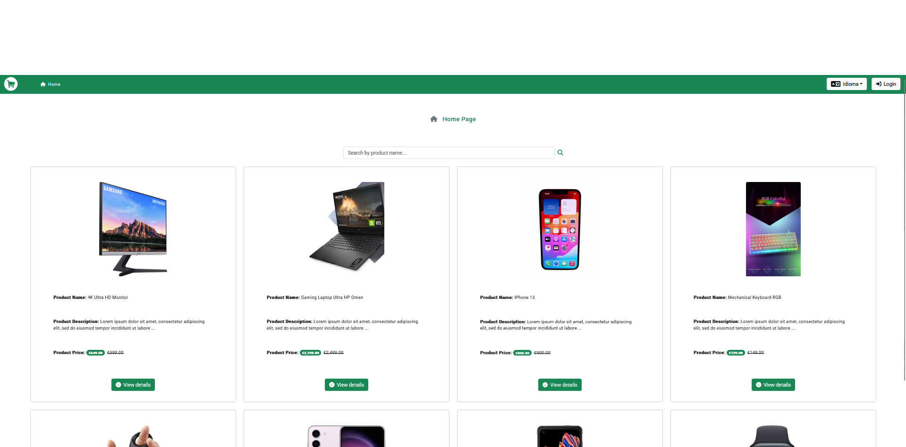

### Product detail
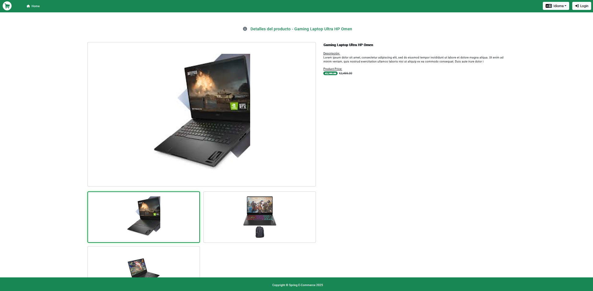

### Dashboard
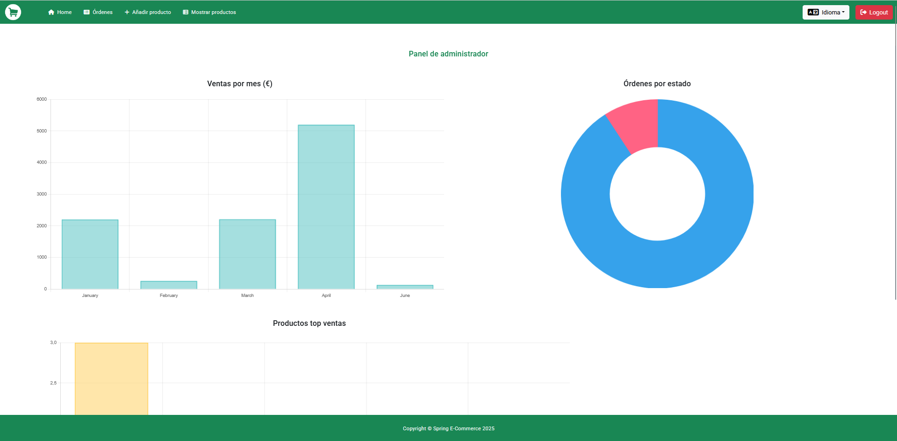

### Dashboard
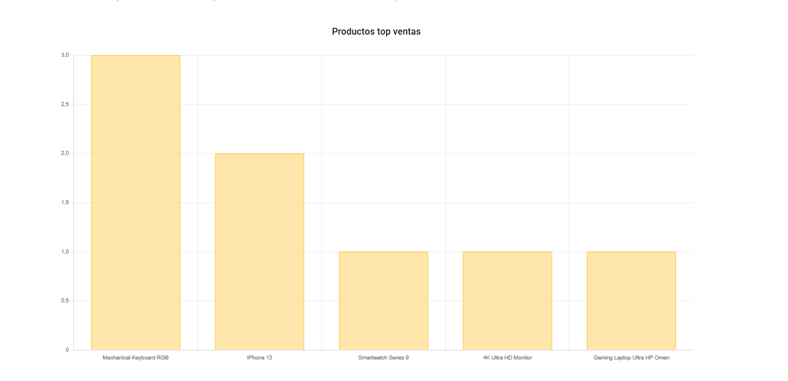

### Admin / Orders
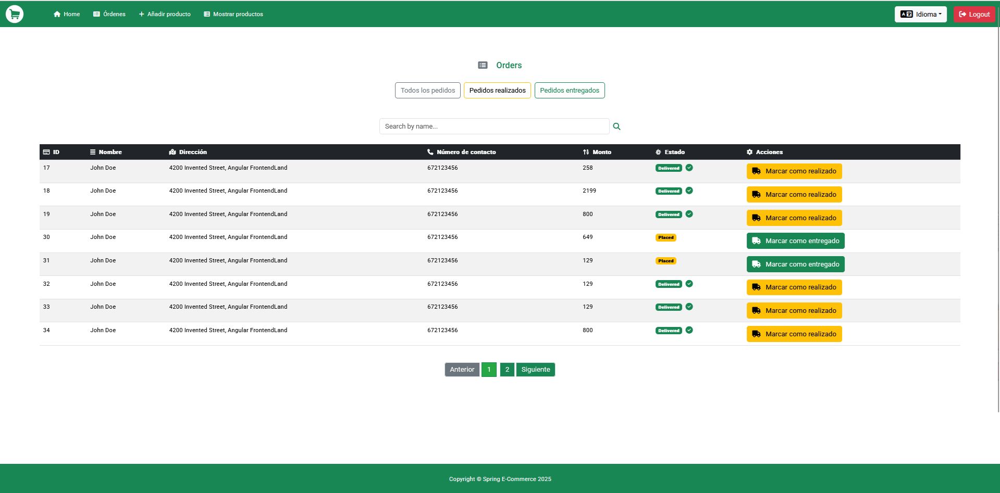

### Admin / Product creation - edition
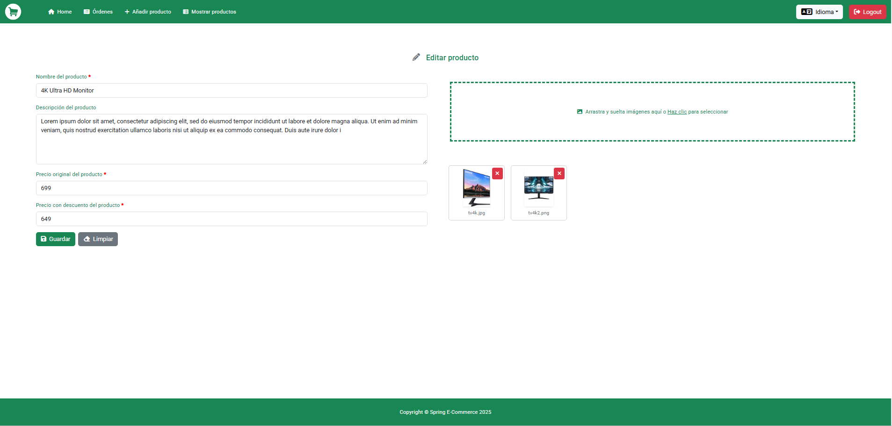

### Admin / Product list
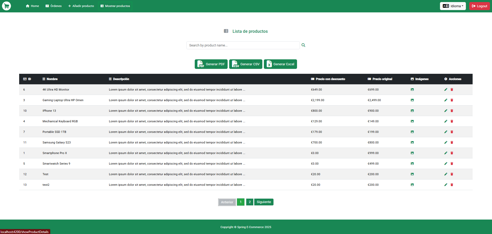

### Admin / Product list delete product sweet alert
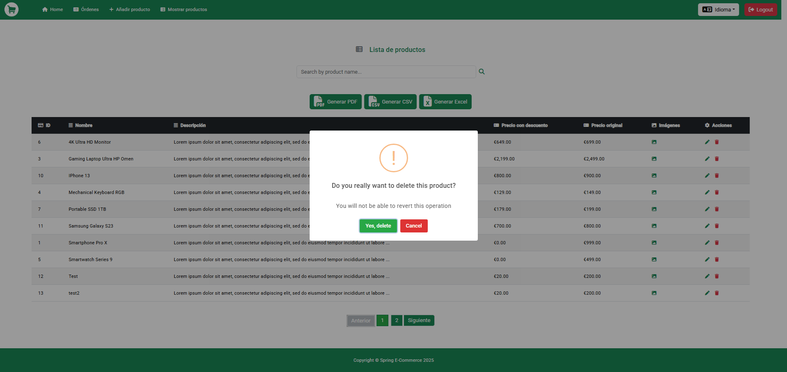

### Admin / Product list image preview
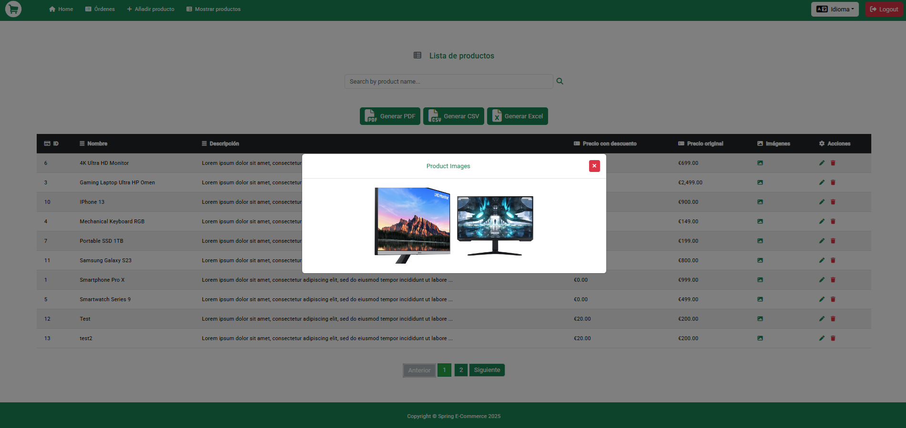

### Admin / CSV export
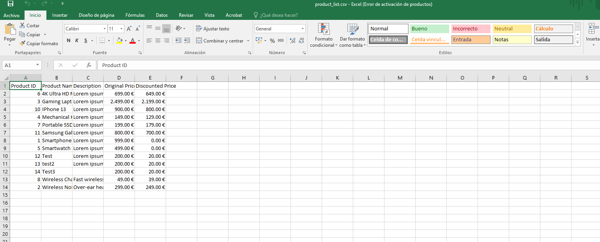

### Admin / PDF export
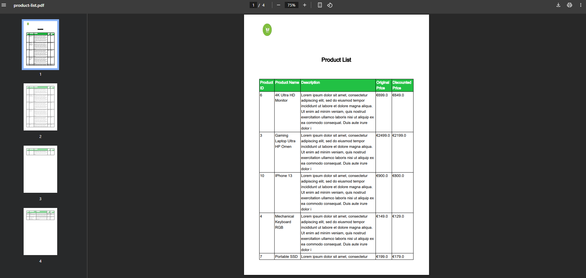

### Admin / XLSX export
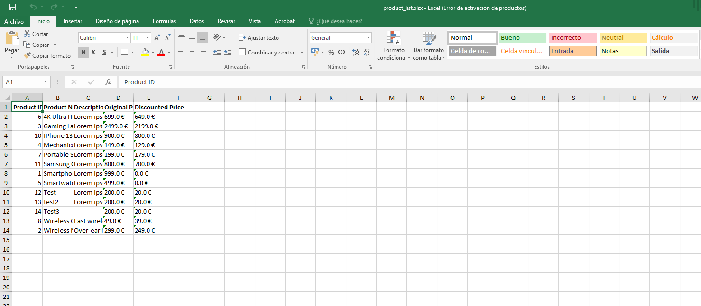

### User / Cart
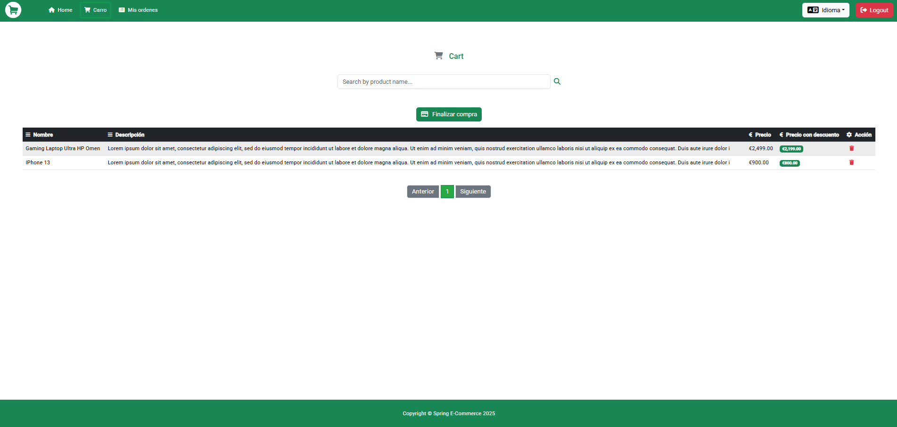

### User / Payment
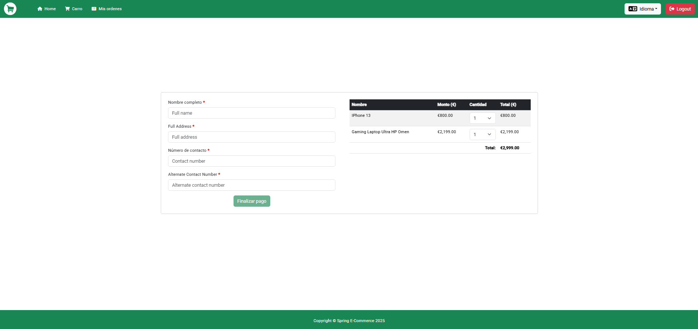

### User / PayPal sand box
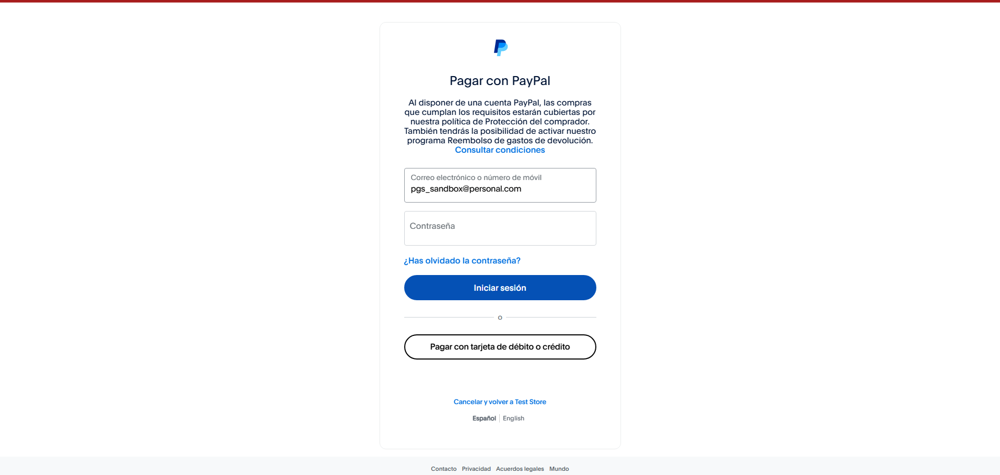

### User / PayPal sand box
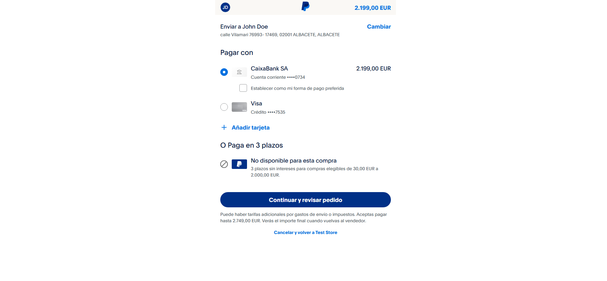

### User / PayPal success payment
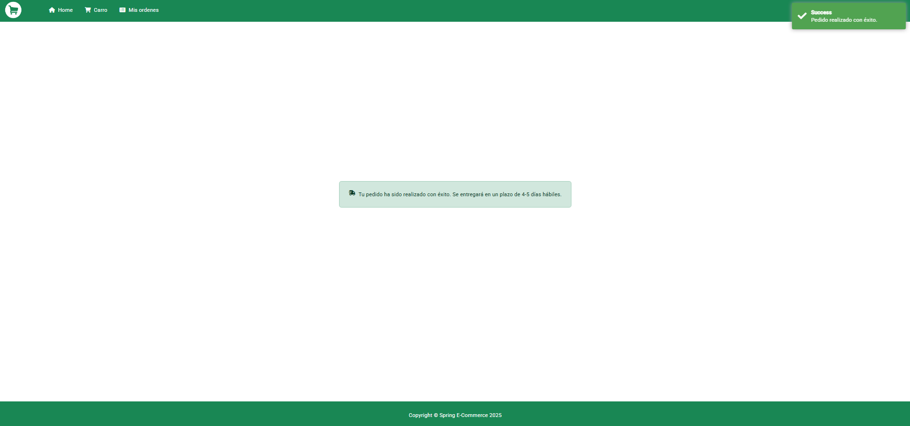

---

